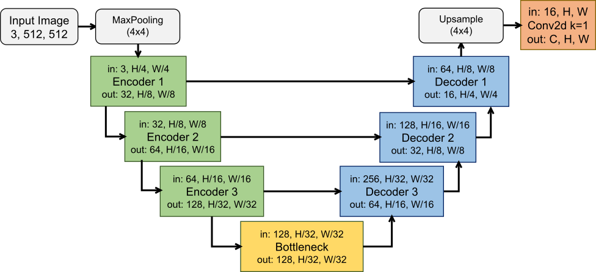

# Using a lightweight U-Net as the RPN combined with a robust U-Net for image segmentation

## Project

We propose a pipeline that employs a lightweight U-Net variant based on ULite for generating regions of interest (ROIs), followed by a robust Attention U-Net for ROI segmentation. Patches were extracted from the ROIs and evaluated under multiple configurations, with patch sizes ranging from 384×384 to 48×48. Other efficient architectures, including MobileNetV2 with DeepLabV3, UNext, and ULite, were also assessed for ROI generation and compared with our proposed MiniULite. Experiments were conducted on GPU, CPU, and ARM platforms.


---

## Pipeline (Our proposal)

In summary, we use a lightweight UNet as RPN and a robust UNet to perform the final segmentation.

<p align="center">
  
</p>

---


## Architecture of our MiniULite

Here is the lightweight UNet architecture based on ULite.

<p align="center">
  
</p>

---

## Instructions

This repository includes scripts for **data augmentation** and **training** using our proposal MiniULite and others networks (MobileNetV2 with DeepLabV3, UNext, ULite and Attention U-Net).  

You must download the dataset manually from its source:

- **FuSeg**: [Foot Ulcer Segmentation Challenge](https://github.com/uwm-bigdata/wound-segmentation/tree/master/data/Foot%20Ulcer%20Segmentation%20Challenge)  

---

## Usage

First, it is mandatory to obtain the dataset, as we did not include it in the repository. After obtaining the dataset, it is recommended to perform data augmentation and then generate datasets with patches of (48,64,128,256,384) based on the augmented dataset. Only after these steps can you test the Pipeline. 

It is not necessary to train the UNext, ULite and MiniULite models as it was possible to include them in the repository, but it will be necessary to train the Attention U-Net and MobileNetV2+DeepLabV3 separately and include them here as the models are too large to be versioned. You can train them with the DeepLabV3.ipynb and AttenUNets.ipynb scripts.

1. After downloading the dataset, extract it to a folder of your choice.  
2. Open the notebook **`pipeline_proposal/01 - Augmentation.ipynb`** and set the variable:

```python
original_dataset_path = "/path/to/your/dataset"
```

Run all cells to generate the augmented dataset.

Then open **`pipeline_proposal/02 - create_patches.ipynb`** to create the patches of (48,64,128,256,384).

If you encounter dependency issues, use the provided environment.yml file to recreate the environment:

```bash
conda env create -f environment.yml
conda activate yourenvironment
```
3. To test the Pipeline open the **`pipeline_proposal/03 - Pipeline.ipynb`** read the instructions carefully and run the desired cells.

## Credits to Other Networks

This repository also includes training with other networks such as:
- [Attention U-Net](https://github.com/LeeJunHyun/Image_Segmentation/tree/master)
- [ULite](https://github.com/duong-db/U-Lite)
- [UNext](https://github.com/jeya-maria-jose/UNeXt-pytorch)
- [DeepLabV3](https://github.com/tensorflow/models/tree/master/research/deeplab)
